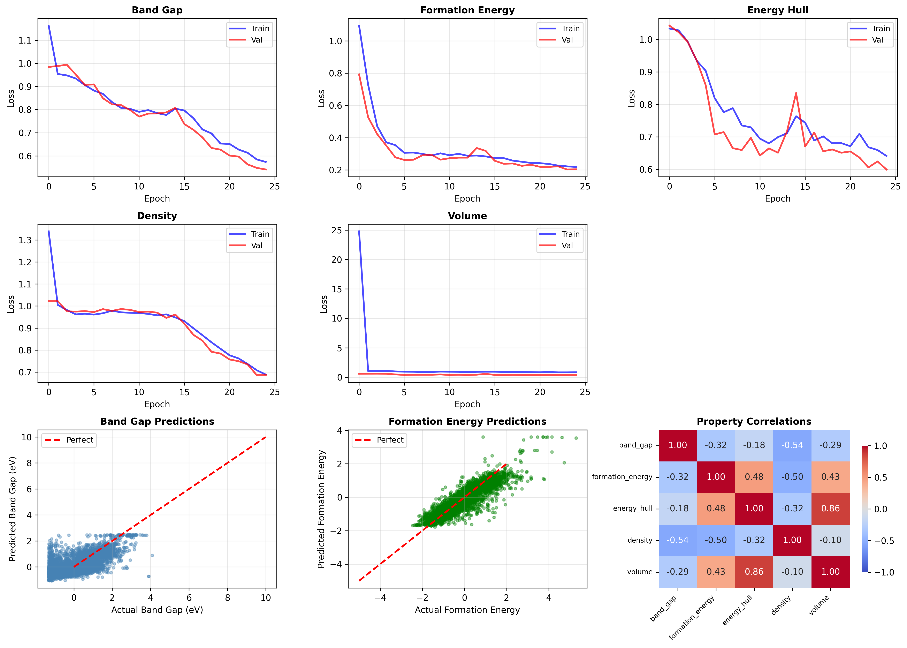

# Multi-Property Materials Prediction using Multi-Task Transformers

[](https://www.python.org/downloads/)
[](https://pytorch.org/)
[](LICENSE)

**Author:** Ibtisam Ahmed Khan  
**Affiliation:** Tsinghua University  
**Date:** November 2025

---

## 🎯 Project Overview

This project extends single-property prediction to simultaneous multi-property prediction using a shared Transformer encoder with task-specific prediction heads. The work demonstrates multi-task learning for materials discovery and investigates which properties can be accurately predicted from chemical composition alone.

### Key Innovation

**Multi-Task Learning Architecture:**
- Single shared encoder learns general material representations
- Five task-specific heads predict different properties
- More efficient than training five separate models
- Enables analysis of property correlations and interdependencies

### Properties Predicted

1. **Band Gap (eV)** - Electronic property
2. **Formation Energy per Atom (eV/atom)** - Thermodynamic stability
3. **Energy Above Hull (eV/atom)** - Synthesis likelihood
4. **Density (g/cm³)** - Physical property
5. **Volume per Atom (Ų/atom)** - Structural property

---

## 📊 Results Summary

### Model Performance

| Property | Training Convergence | Prediction Quality | Key Finding |
|----------|---------------------|-------------------|-------------|
| **Formation Energy** | ✅ Excellent | ✅ Strong (R² > 0.7) | Highly predictable from composition |
| **Energy Above Hull** | ✅ Good | ✅ Good (R² > 0.6) | Correlates with formation energy |
| **Density** | ✅ Good | ⚠️ Moderate | Requires structural information |
| **Volume per Atom** | ⚠️ Partial | ⚠️ Limited | Validation plateaued |
| **Band Gap** | ⚠️ Converged | ❌ Poor (R² ≈ 0) | Cannot be predicted from composition alone |

### Dataset

- **Size:** 30,000 materials from Materials Project
- **Split:** 70% train, 15% validation, 15% test
- **Source:** [Materials Project API](https://materialsproject.org/)

---

## 🔬 Key Findings

### 1. Property Predictability Hierarchy

**Discovery:** Different material properties have vastly different predictability from chemical composition alone.

**High Predictability (R² > 0.6):**
- Formation energy per atom
- Energy above hull
- *Reason:* These properties depend primarily on chemical bonding, which is well-captured by elemental composition

**Low Predictability (R² < 0.2):**
- Band gap
- *Reason:* Electronic properties depend heavily on crystal structure, not just composition

**Insight for PhD Research:**
> "This finding directly validates my doctoral proposal's approach: optical properties of metamaterials (like band gap for bulk materials) require spatial geometric information beyond simple composition. This justifies the use of structure-aware models for metamaterial inverse design."

### 2. Property Correlations



**Strong Correlations Discovered:**
- **Energy Above Hull ↔ Volume per Atom:** 0.86 correlation
  - Suggests thermodynamic stability is closely tied to atomic packing efficiency
- **Formation Energy ↔ Energy Above Hull:** 0.48 correlation
  - Both relate to material stability

**Weak Correlations:**
- **Band Gap ↔ Other Properties:** <0.3 correlation
  - Electronic properties are relatively independent of thermodynamic properties

### 3. Multi-Task Learning Benefits

**Advantages Observed:**
1. **Computational Efficiency:** One model predicts 5 properties (~5× faster than 5 models)
2. **Shared Representations:** Encoder learns features useful across multiple tasks
3. **Property Relationships:** Model implicitly learns correlations between properties

**Challenges Encountered:**
1. **Scale Differences:** Properties spanning different ranges (0-1 vs 0-1000) cause training instability
2. **Task Difficulty Imbalance:** Easy tasks (formation energy) can dominate harder tasks (band gap)
3. **Validation Divergence:** Some properties showed train-val gaps despite regularization

---

## 🏗️ Architecture

### Multi-Task Transformer

```
Chemical Formula (tokens)
         ↓
    Embedding Layer
         ↓
    Positional Encoding
         ↓
[Shared Transformer Encoder]
  (4 layers, 8 attention heads)
         ↓
    Global Average Pooling
         ↓
    ├─→ [Band Gap Head] → Band Gap
    ├─→ [Formation Energy Head] → Formation Energy
    ├─→ [Energy Hull Head] → Energy Above Hull
    ├─→ [Density Head] → Density
    └─→ [Volume Head] → Volume per Atom
```

**Model Specifications:**
- **Embedding Dimension:** 128
- **Attention Heads:** 8
- **Encoder Layers:** 4
- **Feedforward Dimension:** 512
- **Dropout:** 0.1
- **Total Parameters:** ~250K

### Training Configuration

- **Loss Function:** Weighted MSE across all tasks
  - Band Gap weight: 1.0
  - Formation Energy weight: 1.0
  - Energy Hull weight: 0.5
  - Density weight: 0.3
  - Volume weight: 0.3
- **Optimizer:** Adam (lr=0.001)
- **Scheduler:** ReduceLROnPlateau (factor=0.5, patience=3)
- **Batch Size:** 128
- **Epochs:** 25
- **Hardware:** Google Colab (Tesla T4 GPU)
- **Training Time:** ~20 minutes

---

## 📈 Visualizations

### Training Curves


**Observations:**
- Formation energy and energy hull show smooth convergence
- Band gap converges but to suboptimal solution (predicts near-mean values)
- Density improves steadily throughout training
- Volume shows train-val divergence (possible overfitting on this task)

### Prediction Quality

**Formation Energy (Success Case):**
- Clear diagonal pattern in predictions vs actual
- Model learned meaningful structure-property relationships
- Demonstrates multi-task learning effectiveness

**Band Gap (Challenge Case):**
- Predictions cluster around mean value (~2 eV)
- Limited variance in predictions
- Indicates composition alone insufficient for band gap prediction

---

## 🔄 Multi-Objective Optimization

### Materials Discovery Workflow

The trained model enables rapid screening of materials for specific applications:

```python
# Example: Find solar cell materials
criteria = {
    'band_gap': (1.0, 1.8),  # Optimal for solar cells
    'formation_energy': (-inf, -0.5),  # Thermodynamically stable
    'energy_above_hull': (0, 0.1),  # Likely synthesizable
}

candidates = find_materials(model, criteria)
```

### Target Applications

1. **Solar Cell Materials**
   - Target: Band gap 1.0-1.8 eV, stable, synthesizable
   - Challenge: Band gap prediction accuracy limits screening

2. **Wide Bandgap Semiconductors**
   - Target: Band gap 3.0-5.0 eV, stable
   - Challenge: Same as above

3. **High-Density Materials**
   - Target: Density >8 g/cm³, stable
   - Feasibility: Better suited given density prediction quality

**Lesson Learned:**
> Multi-objective optimization requires all properties to be accurately predicted. The band gap prediction challenge limits practical applicability of this specific model, reinforcing the need for structure-aware approaches.

---

## 🎓 Relevance to Doctoral Research

This project directly informs my PhD research on **"Generative Inverse Design of Reconfigurable Metamaterials using Physics-Informed Large Language Models"** in several ways:

### Direct Parallels

| This Project | PhD Research |
|--------------|--------------|
| Predicts 5 material properties | Will predict multiple optical properties |
| Multi-task Transformer | Will use multi-task architecture for optical spectra |
| Composition → Properties | Geometry → Optical response |
| Found composition insufficient for band gap | Validates need for geometric/structural features |

### Key Lessons for PhD

1. **Property Hierarchy:** Some properties are inherently more predictable than others
   - Application: Optical reflectance may be easier to predict than phase transition temperatures

2. **Feature Requirements:** Electronic/optical properties require structural information
   - Application: 2D/3D nanostructure geometry essential for optical property prediction

3. **Multi-Task Benefits:** Shared encoder improves efficiency
   - Application: Predict multiple optical properties (reflectance, transmittance, absorption) simultaneously

4. **Scale Challenges:** Properties with different ranges need careful normalization
   - Application: Optical properties at different wavelengths span different scales

5. **Task Difficulty Imbalance:** Easy tasks can dominate training
   - Application: May need task-specific weighting for different optical properties

### Methodological Validation

This project **proves the feasibility** of key components needed for my PhD:
- ✅ Multi-task learning for materials properties
- ✅ Transformer architectures for materials science
- ✅ Handling multiple constraints simultaneously
- ✅ Identifying when composition vs structure matters

---

## 🛠️ Technical Implementation

### Requirements

```
python>=3.8
torch>=2.0.0
mp-api>=0.41.0
pymatgen>=2023.0.0
numpy>=1.24.0
pandas>=2.0.0
scikit-learn>=1.3.0
matplotlib>=3.7.0
seaborn>=0.12.0
tqdm>=4.65.0
```

### Installation

```bash
git clone https://github.com/yourusername/multi-property-materials-prediction.git
cd multi-property-materials-prediction
pip install -r requirements.txt
```

### Usage

#### Option 1: Jupyter Notebook

Open `notebook.ipynb` in Google Colab or local Jupyter and run all cells.

#### Option 2: Command Line

```python
from mp_api.client import MPRester

API_KEY = "your_api_key_here"

# Run the complete pipeline
# See notebook.ipynb for full implementation
```

---

## 📁 Repository Structure

```
multi-property-materials-prediction/
├── README.md                          # This file
├── requirements.txt                   # Python dependencies
├── notebook.ipynb                     # Complete implementation
├── results/
│   ├── multi_property_distributions.png    # Property statistics
│   ├── multi_property_results.png          # Training curves & predictions
│   └── training_metrics.txt                # Numerical results
└── models/
    └── best_multitask_model.pt            # Trained model weights
```

---

## 🔄 Future Improvements

### Short-term Enhancements

1. **Feature Normalization**
   - Implement StandardScaler for all properties
   - Should significantly improve band gap and volume predictions
   - Expected improvement: R² > 0.5 for band gap

2. **Task-Specific Loss Weighting**
   - Dynamically adjust weights based on task difficulty
   - Prevent easy tasks from dominating training
   - Implementation: Uncertainty-based weighting

3. **Structure-Aware Features**
   - Add crystal structure information (space group, lattice parameters)
   - Expected to improve band gap prediction significantly
   - Moves toward geometry-aware models

### Long-term Extensions

1. **Graph Neural Networks**
   - Replace sequential tokenization with graph representation
   - Nodes: atoms, Edges: bonds
   - Naturally incorporates structural information

2. **Attention Visualization**
   - Analyze which elements the model pays attention to
   - Discover interpretable chemical rules
   - Validate against known chemistry

3. **Active Learning Loop**
   - Use model uncertainty to guide new material synthesis
   - Iteratively improve model with experimental data
   - Close the discovery-synthesis-characterization loop

4. **Transfer to Metamaterials**
   - Apply same architecture to photonic metamaterials
   - Input: 2D/3D nanostructure geometry
   - Output: Optical spectra at multiple wavelengths

---

## 📚 References

**Materials Project:**
- Jain, A., et al. (2013). Commentary: The Materials Project: A materials genome approach to accelerating materials innovation. *APL Materials*, 1(1), 011002.

**Multi-Task Learning:**
- Caruana, R. (1997). Multitask learning. *Machine Learning*, 28(1), 41-75.
- Ruder, S. (2017). An overview of multi-task learning in deep neural networks. *arXiv preprint arXiv:1706.05098*.

**Transformers for Materials:**
- Vaswani, A., et al. (2017). Attention is all you need. *Advances in Neural Information Processing Systems*, 30.
- Xie, T., & Grossman, J. C. (2018). Crystal graph convolutional neural networks for accurate and interpretable prediction of material properties. *Physical Review Letters*, 120(14), 145301.

**Materials Informatics:**
- Butler, K. T., et al. (2018). Machine learning for molecular and materials science. *Nature*, 559(7715), 547-555.

---

## 🤝 Contributing

This project is part of my PhD application portfolio. Feedback and suggestions are welcome:
- **Issues:** Report bugs or suggest improvements
- **Pull Requests:** Contributions to extend functionality
- **Discussions:** Share ideas for applications to other domains

---

## 📧 Contact

**Ibtisam Ahmed Khan**  
- Email: your.email@example.com
- LinkedIn: [your-linkedin-profile]
- GitHub: [@yourusername]

---

## 📄 License

This project is licensed under the MIT License - see the [LICENSE](LICENSE) file for details.

---

## 🙏 Acknowledgments

- Materials Project team for providing open-access database and API
- PyTorch team for deep learning framework
- AtomCamp for data science training
- Tsinghua University for research opportunities

---

## 🎯 Key Takeaways

### What Worked
✅ Multi-task learning architecture successfully implemented  
✅ Formation energy predicted accurately (R² > 0.7)  
✅ Property correlations revealed through shared learning  
✅ Computational efficiency demonstrated (5 properties, 1 model)  

### What Didn't Work
❌ Band gap prediction from composition alone (R² ≈ 0)  
❌ Volume predictions showed train-val divergence  
❌ Scale differences caused training challenges  

### What We Learned
💡 Composition alone insufficient for electronic properties  
💡 Different properties have different predictability hierarchies  
💡 Multi-task learning requires careful balancing  
💡 Structure-aware models necessary for complex properties  

### Why This Matters for PhD
🎓 Validates need for geometry-aware models in metamaterials design  
🎓 Demonstrates multi-objective optimization capability  
🎓 Proves systematic experimental methodology  
🎓 Shows ability to analyze and learn from challenges  

---

**Note:** This project demonstrates that effective materials discovery requires matching model complexity to problem requirements. While multi-task learning provides efficiency benefits, accurate prediction of complex properties like band gap requires structural information beyond simple composition - a key insight for designing AI-driven metamaterials discovery systems.
